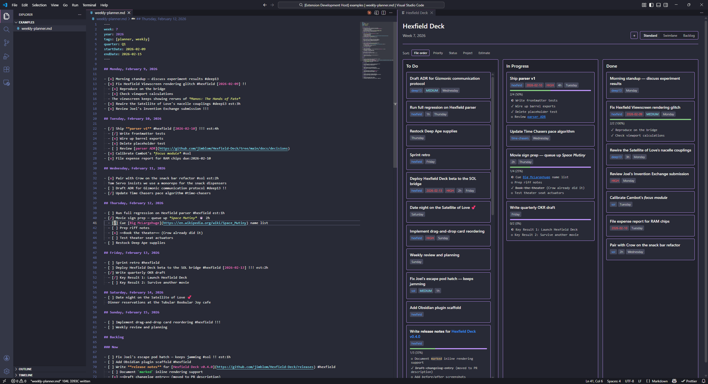
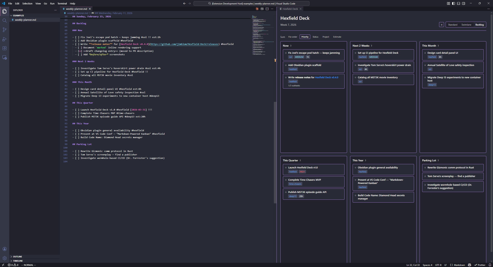

# Hexfield Deck

> **Markdown-powered kanban task board for VS Code and Obsidian**

Hexfield Deck transforms your markdown weekly planner files into interactive kanban boards. Write tasks in plain text with inline metadata, then visualize and manage them on a drag-and-drop board — all without ever leaving your editor.



| Swimlane View | Backlog View |
|:---:|:---:|
|  |  |

---

## ✨ Features

### Current (v0.4.0)

- ✅ **3-column kanban board** (To Do / In Progress / Done)
- ✅ **Drag-and-drop editing** — Move cards between columns to update checkbox states
- ✅ **Interactive sub-task checkboxes** — Click to cycle through To Do → In Progress → Done
- ✅ **Live markdown sync** — Edit the file, board updates automatically
- ✅ **Rich metadata badges** — Project tags, due dates, priorities, time estimates
- ✅ **Color-coded due dates** — Overdue (red), today (orange), upcoming (yellow), future (gray)
- ✅ **Sub-task progress tracking** — Progress bars and checklist visualization
- ✅ **Context menu integration** — Right-click any `.md` file to open as a board
- ✅ **Unsaved changes indicator** — Visual feedback when the board has pending changes
- ✅ **Native VS Code theming** — Matches your editor's color scheme
- ✅ **Swimlane view** — Day-of-week rows × status columns with cross-day drag-and-drop
- ✅ **Backlog view** — Priority buckets (Now, Next 2 Weeks, This Month, etc.) with drag between sections
- ✅ **Card sorting** — Sort by file order, priority, status, project, or estimate across all views
- ✅ **View persistence** — Selected view remembered across panel show/hide
- ✅ **Right-click context menu** — Edit title, due date, time estimate, priority, state, or delete any task
- ✅ **Quick Add** — `+` button in toolbar inserts a new task into today's section
- ✅ **Open in Markdown** — Jump directly to any task's source line from the board
- ✅ **Inline markdown rendering** — Bold, italic, strikethrough, code spans, and links render in card and sub-task titles; links open in the browser

### Coming Soon

- 🗓️ **Week navigation** — Browse weeks with auto-file creation
- 🎨 **Project customization** — Configure colors and links for project tags
- 🔌 **Obsidian plugin** — Full feature parity for Obsidian users

---

## 🚀 Quick Start

### Installation

**Option 1: From Release (Recommended for Testing)**

1. Download the latest `.vsix` from the [Releases](../../releases) page
2. In VS Code: `Extensions → ⋯ → Install from VSIX...`
3. Select the downloaded `.vsix` file

**Option 2: From Source**

```bash
git clone git@github.com:jimblom/Hexfield-Deck.git
cd Hexfield-Deck
pnpm install
pnpm build
cd packages/vscode-extension
pnpm package
# Install the generated .vsix file
```

### Usage

1. Open a weekly planner markdown file (see [example format](#markdown-format))
2. Open the command palette (`Ctrl+Shift+P` / `Cmd+Shift+P`)
3. Run **"Hexfield Deck: Open Board"**
4. The board opens beside your editor with live updates

---

## 📝 Markdown Format

Hexfield Deck parses structured markdown files with a specific format:

```markdown
---
week: 7
year: 2026
tags: [planner, weekly]
---

## Monday, February 9, 2026

- [ ] Fix rendering glitch #hexfield [2026-02-09] !!
    - [x] Reproduce on the bridge
    - [ ] Check viewport calculations
- [/] Rewire nacelle couplings #deep13 est:3h
- [ ] Review submission !!!

## Tuesday, February 10, 2026

- [ ] Ship parser v1 #hexfield [2026-02-10] !!! est:4h

## Backlog

### Now

- [ ] Urgent item #project

### Next 2 Weeks

- [ ] Coming soon #project
```

**Checkbox States:**

- `[ ]` → To Do
- `[/]` → In Progress
- `[x]` → Done

**Metadata Syntax:**

- `#project-name` → Project tag (blue badge) — must have a space before `#`
- `[2026-02-15]` → Due date (color-coded by proximity)
- `!!!` / `!!` / `!` → Priority (high/medium/low)
- `est:2h` → Time estimate

**Inline Markdown in Titles:**

Card and sub-task titles support inline markdown formatting:

| Syntax | Renders as |
|--------|-----------|
| `**bold**` | **bold** |
| `*italic*` | *italic* |
| `~~strikethrough~~` | ~~strikethrough~~ |
| `` `code` `` | `code` |
| `[link text](https://example.com)` | clickable link (opens in browser) |

> **Note:** URL fragments like `https://example.com#section` are handled correctly — the `#section` part is not treated as a project tag.

See [examples/weekly-planner.md](examples/weekly-planner.md) for a complete example.

---

## 📚 Documentation

- **[User Guide](USER_GUIDE.md)** — Complete usage documentation _(coming soon)_
- **[Setup Guide](SETUP.md)** — Development environment setup
- **[Implementation Plan](IMPLEMENTATION_PLAN.md)** — Roadmap and phases
- **[Architecture Decisions](docs/decisions/)** — Technical ADRs

---

## 🛠️ Development

### Prerequisites

- [Volta](https://volta.sh/) for Node.js version management
- [pnpm](https://pnpm.io/) for package management

### Setup

```bash
git clone git@github.com:jimblom/Hexfield-Deck.git
cd Hexfield-Deck
pnpm install
pnpm build
```

### Testing the Extension

1. Open the project in VS Code
2. Press `F5` to launch the Extension Development Host
3. Open `examples/weekly-planner.md` in the new window
4. Run **"Hexfield Deck: Open Board"**

### Architecture

This is a monorepo with three packages:

```
packages/
├── core/              # Shared TypeScript library (parser, models)
├── vscode-extension/  # VS Code extension
└── obsidian-plugin/   # Obsidian plugin (Phase 8)
```

See [IMPLEMENTATION_PLAN.md](IMPLEMENTATION_PLAN.md) for the full technical plan.

---

## 🎯 Roadmap

| Phase       | Status      | Description                       |
| ----------- | ----------- | --------------------------------- |
| **Phase 1** | ✅ Complete | Core parser + basic webview board |
| **Phase 2** | ✅ Complete | Drag-and-drop + real-time sync    |
| **Phase 3** | ✅ Complete | Interactive sub-task checkboxes   |
| **Phase 4** | ✅ Complete | Multiple views & sorting          |
| **Phase 5** | ✅ Complete | Context menu CRUD operations      |
| **Phase 6** | ✅ Complete | Inline markdown rendering         |
| **Phase 7** | 🔜 Next     | Week navigation                   |
| **Phase 8** | 📋 Planned  | Settings & production polish      |
| **Phase 9** | 🔮 Future   | Obsidian plugin                   |

**Target:** v1.0.0 release in ~8 weeks from start

See [IMPLEMENTATION_PLAN.md](IMPLEMENTATION_PLAN.md) for detailed phase breakdowns.

---

## 🎬 About the Name

**Hexfield Deck** is named after the **Hexfield Viewscreen** on the Satellite of Love from _Mystery Science Theater 3000_ — the ship's main visual display and communication screen. The name is a triple reference:

- **Hexfield** — The iconic hexagonal viewscreen
- **Deck** — The command deck where the viewscreen lives, a deck of cards (kanban), and the connotation of command/oversight

---

## 📜 License

MIT License — Copyright (c) 2026 Jim Lindblom (jimblom)

See [LICENSE](LICENSE) for details.

---

## 🤝 Contributing

This is a personal project in early development. Contributions are welcome once v1.0.0 is released. For now, feel free to:

- 🐛 [Report bugs](../../issues)
- 💡 [Suggest features](../../issues)
- 📖 [Improve documentation](../../pulls)

---

## 🔗 Links

- **Repository:** [github.com/jimblom/Hexfield-Deck](https://github.com/jimblom/Hexfield-Deck)
- **Issues:** [github.com/jimblom/Hexfield-Deck/issues](https://github.com/jimblom/Hexfield-Deck/issues)
- **Author:** Jim Lindblom ([@jimblom](https://github.com/jimblom))
- **License:** MIT

---

**Keep the Satellite running. Keep your tasks in order. Welcome to Hexfield Deck.** 🚀
