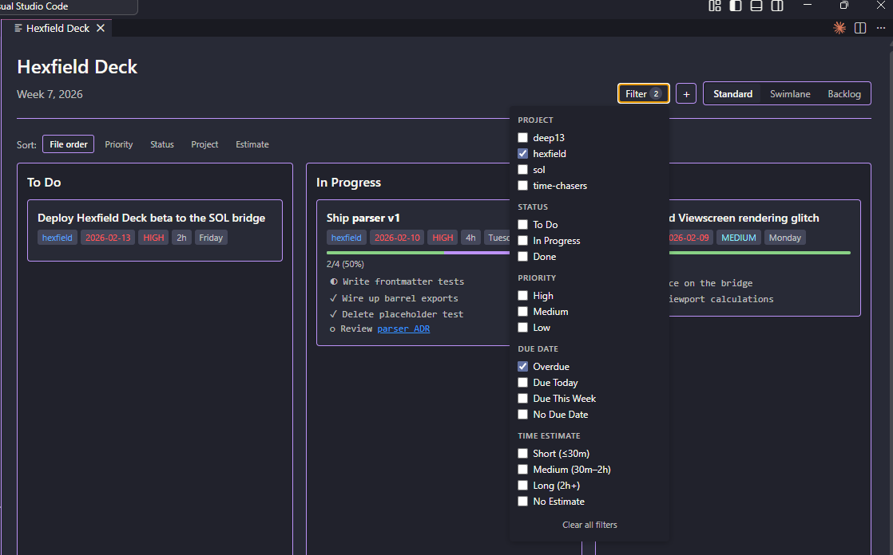

# Hexfield Deck User Guide

Complete reference for markdown file format and features supported by Hexfield Deck.

---

## Quick Start

Hexfield Deck displays your markdown tasks as a Kanban board. Here's the minimal format:

```markdown
---
type: hexfield-planner
week: 1
year: 2026
tags: [planner, weekly]
---

## Monday, February 5, 2026

- [ ] My first task #project-1
- [ ] Another task #project2
- [x] Completed task #another_project
```

Open this file in VS Code, run **Hexfield Deck: Open Board**, and see your tasks as cards!

---

## File Structure

### Frontmatter

Every file must start with YAML frontmatter:

```yaml
---
type: hexfield-planner          # Hexfield product identifier (required)
week: 1                         # Week number (required)
year: 2026                      # Year (required)
tags: [planner, weekly]         # Tags array (required)
start_date: 2026-02-05          # Optional: Week start date
end_date: 2026-02-09            # Optional: Week end date
---
```

**Required fields:** `type`, `week`, `year`, `tags`

### Heading Hierarchy

Hexfield Deck expects this structure:

```markdown
## Monday, February 5, 2026   ← Level 2: Day grouping
- [ ] Task #project-tag       ← Checkbox: Individual task
```

**Rules:**
- Tasks under a set day appear in Standard and Swimlane views
- Day headings format: `## {DayName}, {Month} {Day}, {Year}`

### Projects

Use a hashtag (#)-prefaced tag to group tasks by project:

```markdown
## Monday, February 5, 2026

- [ ] Task belongs to Time Chaser activity tracker #time-chaser
- [ ] Another Time Chaser task #time-chaser

- [ ] Task belongs to Deep 13 home lab #deep-13
```

**Important:** The `#` must be preceded by a space (or be at the start of the title). A `#` inside a URL — such as `https://example.com/page#section` — is treated as a URL fragment, not a project tag.

Projects are used for:
- Color coding cards
- Visual grouping
- Project headers move with tasks when reorganizing

---

## Tasks & Columns

### Basic Syntax

```markdown
- [ ] Unchecked task → Shows in Todo or In Progress
- [x] Checked task   → Shows in Done
- [/] Checked task   → Shows in Progress
```

**Important:** Use `- [ ]` with a space in brackets, not `- []` or `-[]`

### Three-Column Layout

Hexfield Deck has three columns:

| Column | Markdown | Display |
|--------|----------|---------|
| **Todo** | `- [ ] Task` | Default for unchecked tasks |
| **In Progress** | `- [/] Task` | Tasks you're actively working on |
| **Done** | `- [x] Task` | Completed tasks |

### Drag & Drop Behavior

When you drag a card between columns:

| From | To | Markdown Change |
|------|----|-----------------|
| Todo | In Progress | Adds `[/]` |
| In Progress | Todo | Removes `[/]` |
| In Progress | Done | Removes `[/]`, marks as `[x]` |
| Done | Todo | Unchecks `[x]`, removes tags |
| Done | In Progress | Unchecks `[x]`, adds `[/]` |

**The markdown file is the source of truth** - all changes sync immediately.

---

## Task Details

### Task Body (Sub-bullets)

Add details by indenting lines below a task:

```markdown
- [ ] Main task title #project
  - Sub-bullet detail 1
  - Sub-bullet detail 2
  - More information
```

**Rules:**
- Indent with 2+ spaces or 1 tab
- Displayed as a bulleted list on the card

### Sub-Task Checkboxes

Indented checkboxes become interactive sub-tasks with progress tracking:

```markdown
- [ ] Main task with sub-tasks #project
  - [ ] Sub-task 1
  - [x] Sub-task 2 (completed)
  - [ ] Sub-task 3
```

**Features:**
- Click sub-task checkboxes directly on the card to toggle completion
- Progress bar shows completion percentage (e.g., "1/3 tasks - 33%")
- Sub-tasks can have their own metadata (priority, due date, time estimate)

### Metadata

Enhance tasks with inline metadata for due dates, priority, and time estimates.

#### Due Dates

Track deadlines with visual indicators:

```markdown
- [ ] Task with due date due:2026-02-15
- [ ] Task with due date [2026-02-15]
```

**Format:** `YYYY-MM-DD` (ISO 8601)
**Position:** Anywhere in task title
**Display:** Badge showing "Feb 15" with color-coded status:
- Overdue: Red
- Today: Orange
- Due within 3 days: Yellow
- Future: Gray

#### Priority

Mark task importance with visual badges:

```markdown
- [ ] High priority task !!!

- [ ] Medium priority task !!

- [ ] Low priority task !
```

**Display:** Colored badge (HIGH - red, MED - yellow, LOW - green)

#### Time Estimates

Track how long tasks should take:

```markdown
- [ ] Task with estimate est:30m
```

**Formats:** Hours (`2h`, `1.5h`) or minutes (`30m`, `90m`)
**Display:** Badge showing ⏱️ 2h

### Combining Everything

You can combine all features in one task:

```markdown
- [/] Review documentation [2026-02-10] !!! ⏱️ est:2h #time-chaser
  - [ ] Check for outdated sections
  - [x] Update screenshots
  - [ ] Get feedback from team
```

**This task has:**
- Project: Time Chaser (colored border)
- Status: In Progress
- Due date: Feb 10, 2026
- Priority: High (red badge)
- Time estimate: 2 hours
- Sub-tasks: 3 items with progress tracking (1/3 = 33%)

### Inline Markdown Formatting

Card titles and sub-task titles support inline markdown. Formatting renders directly on the board — no need to open the file to see the result.

| Syntax | Renders as | Example |
|--------|-----------|---------|
| `**text**` or `__text__` | **Bold** | `**Fix this today**` |
| `*text*` or `_text_` | *Italic* | `*nice to have*` |
| `~~text~~` | ~~Strikethrough~~ | `~~cancelled task~~` |
| `` `text` `` | `Code span` | `` Review `npm test` output `` |
| `[label](url)` | Clickable link | `[Design doc](https://notion.so/...)` |

**Links:** Clicking a link on the board opens it in your default browser. Clicking anywhere else on the card still works normally for drag-and-drop.

**Sub-tasks:** Inline markdown works in sub-task lines too. Clicking a link in a sub-task opens the browser without toggling the checkbox.

```markdown
- [ ] Ship **v0.4.0** release #hexfield [2026-02-15] !!!
  - [ ] Update [CHANGELOG](https://github.com/jimblom/Hexfield-Deck)
  - [ ] Run `pnpm test` and confirm green
  - [x] ~~Write placeholder copy~~ (done)
  - [ ] Deploy to *production*
```

---

## Backlog Sections

### Structure

Hexfield Deck supports backlog sections for longer-term planning:

```markdown
## Backlog
### Now
- [ ] Urgent task that needs attention

### Next 2 Weeks
- [ ] Coming up soon

### This Month
- [ ] Monthly goal

## This Quarter
- [ ] Quarterly objective

## This Year
- [ ] Annual goal

## Parking Lot
- [ ] Someday/maybe items
```

### Priority Buckets

The Backlog view organizes tasks into user-defined priority buckets. The below is an example:

| Bucket | Heading | Purpose |
|--------|---------|---------|
| Now (Immediate) | `## Backlog` → `### Now` | Tasks to do this week |
| Next 2 Weeks | `## Backlog` → `### Next 2 Weeks` | Short-term planning |
| This Month | `## Backlog` → `### This Month` | Monthly goals |
| This Quarter | `## This Quarter` | Quarterly objectives |
| This Year | `## This Year` | Annual goals |
| Parking Lot | `## Parking Lot` | Someday/maybe items |

### Moving Between Buckets

- **Drag and drop** cards between buckets in Backlog view
- **Right-click** → "Move to Backlog" submenu to change priority
- **Right-click** → "Move to Day" to schedule a backlog item for a specific day

---

## Board Views

### Standard View

Shows all tasks across the week in three columns:

```
┌─────────────┐  ┌─────────────┐  ┌─────────────┐
│    Todo     │  │ In Progress │  │    Done     │
│             │  │             │  │             │
│  All week   │  │  All week   │  │  All week   │
└─────────────┘  └─────────────┘  └─────────────┘
```

### Swimlane View

Shows tasks organized by day, each with its own three columns:

```
▼ Monday (5 tasks)
  ┌─────────┐  ┌─────────────┐  ┌──────┐
  │  Todo   │  │ In Progress │  │ Done │
  └─────────┘  └─────────────┘  └──────┘

▼ Tuesday (3 tasks)
  ┌─────────┐  ┌─────────────┐  ┌──────┐
  │  Todo   │  │ In Progress │  │ Done │
  └─────────┘  └─────────────┘  └──────┘
```

### Backlog View

Shows backlog tasks in priority buckets for grooming:

```
┌──────────────────┐  ┌──────────────────┐  ┌──────────────────┐
│   Now            │  │   Next 2 Weeks   │  │   This Month     │
│                  │  │                  │  │                  │
└──────────────────┘  └──────────────────┘  └──────────────────┘

┌──────────────────┐  ┌──────────────────┐  ┌──────────────────┐
│   This Quarter   │  │  ️ This Year      │  │  ️ Parking Lot    │
│                  │  │                  │  │                  │
└──────────────────┘  └──────────────────┘  └──────────────────┘
```

Switch views using the toolbar buttons at the top of the board.

---

## Week Navigation

### Navigating Between Weeks

Use the navigation arrows in the toolbar to move between weeks:
- **◀** Previous week
- **▶** Next week

### Auto-Create Week Files

When navigating to a week that doesn't exist:
- Hexfield Deck automatically creates the week file
- Uses a template with proper frontmatter and day sections
- File path pattern: `{year}/week-{WW}/{year}-{WW}-weekly-plan.md`

### Moving Tasks to Different Weeks

For backlog items, right-click and choose:
- **Move to Next Week** - Moves task to Monday of the following week
- **Move to Week...** - Prompts for specific week number

---

## Context Menu

Right-click on any card to access these options:

### All Cards

| Option | Description |
|--------|-------------|
| **Open in Markdown** | Jump to task location in the markdown file |
| **Edit Title...** | Change the task title |
| **Edit Due Date...** | Set or modify due date |
| **Edit Time Estimate...** | Set or modify time estimate |
| **Edit Description...** | Edit the task body/sub-bullets |
| **Set Priority** | Submenu: High, Medium, Low, None |
| **Change Project...** | Move task to different project |
| **Change State** | Submenu: Todo, In Progress, Done |
| **Move to Day** | Submenu: Move to any day of the week |
| **Delete Task...** | Remove the task (with confirmation) |

### Backlog Cards Only

| Option | Description |
|--------|-------------|
| **Move to Backlog** | Submenu: Move between priority buckets |
| **Move to Next Week** | Schedule for Monday of next week |
| **Move to Week...** | Schedule for specific week |

---

## Filtering & Sorting

### Metadata Filtering

Click the **Filter** button in the toolbar to open the filter panel. Filter across five dimensions simultaneously — conditions are AND'd between dimensions and OR'd within each dimension (e.g. "hexfield OR sol" AND "High priority").



| Dimension | Options | Notes |
|-----------|---------|-------|
| **Project** | Any project present in the file | Multi-select; list is built from all cards in the current file |
| **Status** | To Do, In Progress, Done | Useful in Swimlane and Backlog views |
| **Priority** | High, Medium, Low | Cards with no priority are excluded when any priority is selected |
| **Due Date** | Overdue, Due Today, Due This Week, No Due Date | Buckets based on today's date |
| **Time Estimate** | Short (≤30m), Medium (30m–2h), Long (2h+), No Estimate | "No Estimate" finds all unestimated cards |

**Active filter indicator:** The Filter button shows a count badge (e.g. **Filter 2**) when filters are active, and its border highlights.

**Clear all:** A **Clear all filters** button appears at the bottom of the panel when any filter is active. Switching views (Standard → Swimlane → Backlog) does not reset the active filter.

### Sort Options

The sort bar appears below the header in all views:

- **File order** — Default; preserves order from the markdown file
- **Priority** — High → Medium → Low → None
- **Status** — In Progress → To Do → Done
- **Project** — Alphabetical by project name
- **Estimate** — Longest first

---

## Commands & Features

### Available Commands

Access commands via Command Palette (Ctrl+Shift+P):

- **Hexfield Deck: Open Board** - Open Kanban board for current markdown file
- **Hexfield Deck: Refresh Board** - Manually refresh the board

### Quick Add

Click the "+" button in the toolbar to quickly add a new task to the current day.

### Auto-Refresh

The board automatically refreshes in **real-time** as you edit the markdown file. Changes appear on the board within half a second of typing - no need to save!

**Real-Time Updates:**
- Watches the markdown document for any changes
- Automatically refreshes the board 500ms after you stop typing
- Works for all edits: checking boxes, adding in progress markers, changing priorities, etc.
- Debounced to avoid excessive refreshes

### Dirty File Protection

If you have unsaved changes in the markdown editor, Hexfield Deck will:
- Show a warning before making changes
- Offer a "Save Now" button
- Block the operation until you save

This prevents accidental data loss from conflicting edits between the text editor and the board.

---

## Configuration

### Project Colors & Links

Customize project appearance in VS Code settings:

```json
{
  "hexfield-deck.projects": {
    "Time Chaser": {
      "color": "#FF6B6B",
      "link": "https://gitlab.com/jimblom/Time_Chaser"
    },
    "Deep 13": {
      "color": "#4ECDC4",
      "link": "https://gitlab.com/jimblom/Deep_13"
    }
  }
}
```

**Settings:**
- `color`: Hex color code (e.g., `#FF6B6B`)
- `link`: URL to open when clicking project tag (optional)

### Board Preferences

Control default board behavior:

```json
{
  "hexfield-deck.defaultView": "standard",
  "hexfield-deck.showDayBadges": true,
  "hexfield-deck.showMetadataBadges": true,
  "hexfield-deck.autoCollapseSwimlaneDays": false
}
```

**Settings:**
- `defaultView`: Default view when opening board (`"standard"`, `"swimlane"`, or `"backlog"`)
- `showDayBadges`: Show day badges (Mon, Tue, etc.) on cards (default: `true`)
- `showMetadataBadges`: Show metadata badges (priority, due date, time) on cards (default: `true`)
- `autoCollapseSwimlaneDays`: Auto-collapse all days in swimlane view on load (default: `false`)

**Access settings:**
1. Open VS Code Settings (Ctrl+,)
2. Search for "hexfield-deck"
3. Adjust preferences

---

## Complete Example

```markdown
---
type: hexfield-planner
week: 1
year: 2026
tags: [planner, weekly]
start_date: 2026-02-05
end_date: 2026-02-09
---

## Monday, February 5, 2026

- [ ] Review documentation [2026-02-10] !! est:2h #time-chaser
  - [ ] Check for outdated sections
  - [ ] Update screenshots
- [/] Update test suite #deep-13
- [x] Submit weekly report #pumaman

- [ ] Debug loading issue !!! [2026-02-06] est:3h #deep-13
  - [x] Check voltage levels
  - [ ] Review timing diagrams
- [ ] Schedule team meeting est:️30m

## Tuesday, February 6, 2026

- [ ] Code review for PR 13 [2026-02-06] #time-chaser
- [ ] Write unit tests est:1h

## Backlog

### Now
- [ ] Update user guide #hexfield-deck !!!

### Next 2 Weeks
- [ ] Plan H1 roadmap #hexfield-deck

### This Month
- [ ] Research new testing framework #deep-13

## This Quarter
- [ ] Marathon 1 #time-chaser [2026-05-13]
- [ ] Build out our program plan #gpc

## This Year
- [ ] Migrate Deep 13 projects off of GitLab #deep-13
- [ ] Marathon 2 #time-chaser

## Parking Lot
- [ ] Investigate alternative CI/CD options #deep-13
```

---

## Rules & Behavior

### What Gets Parsed

✅ **Day Sections (Standard/Swimlane views):**
- Tasks within `## {Day}` sections (e.g., `## Monday, February 5, 2026`)
- Project groupings from inline tag (`#project-name`)

✅ **Backlog (Backlog view):**
- Tasks under `## Backlog` with subsections (Now, Next 2 Weeks, This Month)
- Tasks under `## This Quarter`
- Tasks under `## This Year`
- Tasks under `## Parking Lot`

❌ **Ignored:**
- Other custom sections not listed above
- Tasks without proper heading hierarchy

### Metadata Parsing

**Order independent:** Metadata can appear in any order
```markdown
- [ ] Task #project [2026-02-10] !!! est:2h    ← Works
- [ ] Task !!! est:2h [2026-02-10] #project    ← Also works
```

**Multiple matches:** First one wins
```markdown
- [ ] Task [2026-02-10] [2026-02-15] #project   ← Uses Feb 10
```

**Stripped from display:** Metadata is removed from card titles
```markdown
- [ ] Review docs #project [2026-02-10] !!!
```
Displays as: **"Review docs"** (metadata shows as badges)

### File Modifications

**Hexfield Deck minimally modifies your markdown:**

| Action | Markdown Change |
|--------|----------------|
| Drag to Done | Changes `- [ ]` to `- [x]`, removes `- [/]` |
| Drag to In Progress | Changes `- [x]` to `- [ ]` (if needed), adds `- [/]` |
| Drag to Todo | Changes `- [x]` to `- [ ]` (if needed), removes `- [/]` |
| Toggle sub-task | Changes `- [ ]` to `- [x]` or vice versa |
| Move to Day | Moves task line(s) to target day section |
| Move to Backlog | Moves task line(s) to target backlog section |
| Edit metadata | Updates priority/due date/time estimate in task line |
| Quick Add card | Inserts new `- [ ] Task` in current day section |

**Project headers are preserved** - when moving a task that's the only one under a project, the project header moves with it.

---

## Troubleshooting

### Cards not appearing?

✅ Check frontmatter has `week`, `year`, `tags`
✅ Verify tasks are under day sections (e.g., `## Monday, February 5, 2026`) or backlog sections
✅ Checkbox format is `- [ ]` with space

### Metadata not showing?

✅ Date format is `YYYY-MM-DD` (not `MM/DD/YYYY`)
✅ Priority uses `!!!`, `!!`, or `!` (exclamation marks)
✅ Time format is `2h` or `30m` (not `2 hours`)

### Context menu not appearing?

✅ Refresh the board (click refresh icon or Ctrl+R in Extension Host)
✅ Check VS Code Developer Tools console for JavaScript errors
✅ Try reloading the Extension Development Host

### Drag & drop not working?

✅ Refresh the board (click refresh icon)
✅ Check VS Code file watcher isn't disabled
✅ Ensure file isn't read-only

### Changes being overwritten?

✅ Save the markdown file before using the board
✅ The "dirty file" warning will appear if you have unsaved changes
✅ Click "Save Now" or manually save before making board changes

---

## Version History

| Version | Highlights |
|---------|-----------|
| **v0.5.0** | Metadata filtering — project (multi-select), status, priority, due date, time estimate |
| **v0.4.0** | Inline markdown rendering in card and sub-task titles (bold, italic, strikethrough, code, links) |
| **v0.3.0** | Right-click context menu, CRUD editing, Quick Add button |
| **v0.2.x** | Multiple views (Swimlane, Backlog), card sorting, view persistence |
| **v0.1.x** | Core parser, 3-column board, drag-and-drop, sub-task checkboxes |

---

## Related Documentation

- [CLAUDE.md](../CLAUDE.md) - CLAUDE Code development guidance for working with the extension
